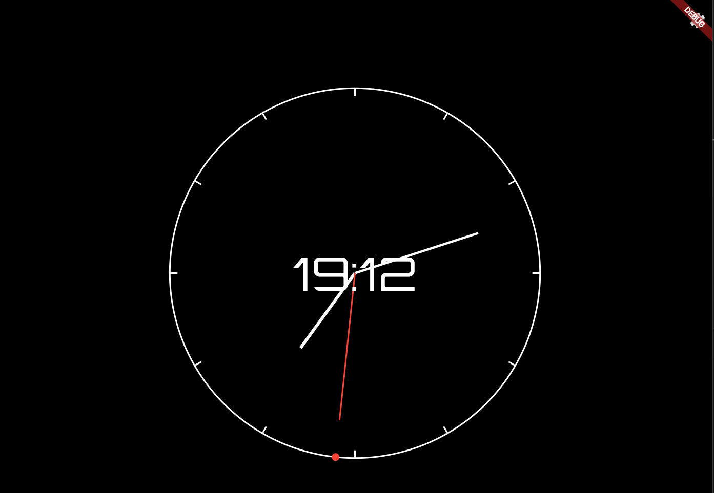

# Analog-style Digital Clock 🕰️

> 「時の流れを、もっと楽しく、心地よく。」

アナログ時計が持つ針の動きや盤面の美しさと、デジタル時計の視認性を融合させた、レトロで遊び心のあるデスクトップ時計アプリケーションです。Flutterを使用して構築されており、高度なカスタマイズ機能であなただけの時計を作成できます。

## 📸 スクリーンショット



---

## ✨ 主な機能

- **アナログとデジタルの融合**:
  - 現在の「時」「分」を中央にデジタル表示。
  - 「秒」はアナログ時計のように円周上を動くインジケーターで表現。
  - 背景にはアナログ時計の美しい文字盤ガイドを表示。

- **🎨 高度なカスタマイズ**:
  - **カラー設定**: デジタル数字、時針、分針、秒針の色を自由に選択可能。
  - **フォントスタイル**: レトロなデジタル風フォントを複数から選択可能。

- **🚀 滑らかなアニメーション**:
  - 時・分が切り替わる際のフリップ風アニメーション。
  - 秒インジケーターの滑らかな円周アニメーション。

- **💾 設定の永続化**:
  - カスタマイズした設定はデバイスに保存され、次回起動時も同じデザインが維持されます。

---

## 🛠️ 使用技術

このアプリケーションは以下の技術スタックで構築されています。

- **フレームワーク**: [Flutter](https://flutter.dev/)
- **状態管理**: [Riverpod](https://riverpod.dev/)
- **フォント**: [Google Fonts](https://pub.dev/packages/google_fonts)
- **設定の永続化**: [Shared Preferences](https://pub.dev/packages/shared_preferences)
- **カラーピッカー**: [Flutter Color Picker](https://pub.dev/packages/flutter_colorpicker)

---

## 🚀 始め方

このプロジェクトをローカル環境で実行するには、以下の手順に従ってください。

1.  **Flutterのセットアップ**:
    - まだの方は、[Flutter公式サイト](https://flutter.dev/docs/get-started/install) の手順に従ってFlutter SDKをインストールしてください。

2.  **リポジトリをクローン**:
    ```sh
    git clone https://github.com/sw0321/analog_digital_clock_flutter.git
    cd YOUR_REPOSITORY
    ```

3.  **依存関係をインストール**:
    ```sh
    flutter pub get
    ```

4.  **アプリケーションを実行**:
    ```sh
    flutter run
    ```
    （デスクトップ、Web、またはモバイルデバイスで実行できます）

---

## 📂 プロジェクト構成

プロジェクトは `Feature-First` の考え方に基づいたディレクトリ構成を採用しています。

```
lib/
├── main.dart
├── core/                  # 共有コア（Providerなど）
│   └── providers/
├── features/
│   ├── clock/             # 時計表示機能
│   │   ├── views/
│   │   ├── widgets/
│   │   └── providers.dart
│   └── settings/          # 設定機能
│       ├── views/
│       └── providers.dart
└── shared/
    └── models/            # 共有モデル
```

---

## 📄 ライセンス

このプロジェクトは [MIT License](LICENSE) の下で公開されています。